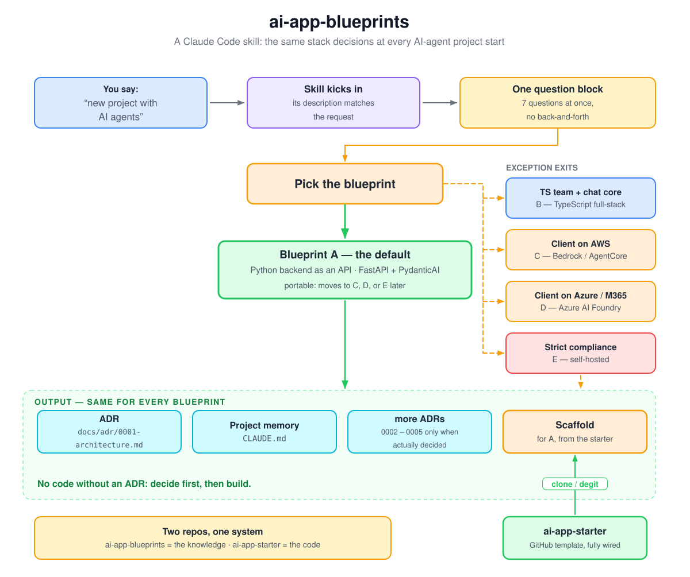

# ai-app-blueprints

[](https://github.com/JulesCyb/ai-app-blueprints/actions/workflows/ci.yml)

A Claude Code skill that makes the stack decision for AI-agent apps — once, in one interview, with receipts.

<p align="center">
  
</p>

<p align="center"><sub><a href="https://excalidraw.com/#json=iOEKDTRymrWp55pk8F9tG,DUsqkkSmw2Shs05mf9VwSA">Open and edit the diagram in Excalidraw</a></sub></p>

---

## The problem

Every AI project starts with the same argument: Which framework? Where do the models run? How does the agent reach the data? What happens when a second customer shows up? And will this survive a GDPR conversation?

Those questions get re-researched every time, usually under deadline pressure, and the answer lands nowhere. Six weeks later, nobody remembers why it was built that way.

## What this skill does

It turns the argument into a routine: **one interview → one blueprint → documented decisions → a working scaffold.** The recommendations come from a written-down research pass (August 2026) that lives in this repo as reference files — readable, checkable, correctable.

The point is **rapid prototyping without closing doors**: the default stack is the one you can build on *today* and still move to AWS, Azure, GCP, or fully self-hosted *later*. Your tools (MCP), data layer, and API contract move with you; on AgentCore and self-hosted, the agent logic itself carries over unchanged — on Azure Foundry, the thin orchestration layer is rebuilt on its runtime. Anything vendor-shaped stays behind an interface.

## One default, four exits

The five blueprints are not five equal menu items. **Blueprint A is the default** — a Python backend as an API (FastAPI + PydanticAI), portable enough to relocate later. The skill leaves A only when a constraint forces it:

| Trigger | Exit |
|---|---|
| Team is TypeScript **and** the product is essentially a chat UI | **B** — TypeScript full-stack |
| Client is on AWS | **C** — Bedrock / AgentCore |
| Client is on Azure / M365 | **D** — Azure AI Foundry |
| Strict data protection, self-hosting mandated | **E** — self-hosted |

(Client on GCP → Vertex/ADK, analogous to C/D.) No trigger? It stays A.

There is deliberately only one starter repo — for the default. Starters for exception cases would rot before anyone used them. When a real B or E project happens, its starter gets extracted from it, not invented up front.

## Install

**Personal, for all projects** — one symlink, Claude Code follows it:

```bash
git clone https://github.com/JulesCyb/ai-app-blueprints ~/src/ai-app-blueprints
mkdir -p ~/.claude/skills
ln -s ~/src/ai-app-blueprints ~/.claude/skills/ai-app-blueprints
```

A `git pull` then updates the skill for every project at once.

**Per project:** copy `SKILL.md`, `references/`, `assets/`, and `evals/` into `.claude/skills/ai-app-blueprints/` (leave `.git` behind) and commit — everyone in the repo gets the skill.

**For a team:** publish it as a plugin in a marketplace, or roll it out via your organization's managed settings.

## Use

The skill activates on its own whenever a new AI project, a tech stack, or an architecture question comes up. Direct invocation works too:

```
/ai-app-blueprints
/ai-app-blueprints client project on Azure, multiple tenants, Android app planned
```

You get **one** block of seven questions — not seven follow-ups in a row. Anything you skip is assumed as a stated default.

## What you get

- `docs/adr/0001-architecture.md` — the decision, with reasoning and alternatives
- `CLAUDE.md` — project memory for Claude Code, filled in rather than generic
- more ADRs, but only when something was actually decided (tenancy, model access, hosting, mobile)
- on request, a running scaffold — for blueprint A from **[ai-app-starter](https://github.com/JulesCyb/ai-app-starter)** (E uses it as a base, with model serving added on top); B–D get a minimal structure per blueprint

What a run looks like:

```text
> internal assistant that searches our contract documents — maybe several customers later

Interview (one block): own project · tenants later · web app · no cloud mandate
                       · EU region · documents + DB · Python
→ Blueprint A.

docs/adr/0001-architecture.md  "We choose blueprint A: FastAPI + PydanticAI, Postgres 17
                                + pgvector with RLS … revisit when a customer demands
                                physical data separation."
CLAUDE.md                       filled in — multi-tenant rules, commands, conventions
scaffold                        from ai-app-starter, tests incl. a real RLS isolation test
```

The full generated decision document: [assets/adr-0001-example.md](assets/adr-0001-example.md).

Ground rule: **no code without an ADR.** Decide first, then build.

## What's in the repo

```
SKILL.md                       flow and principles — loaded when the skill activates
references/
├── blueprints.md              A–E compared: costs, lock-in, switching criteria
├── agent-architecture.md      backend as an API, tools/MCP, streaming, state, mobile clients
├── multi-tenancy.md           1 vs. N tenants, RLS patterns (SQL), context object
├── stack-2026-08.md           research digest — incl. the source list
└── research-2026-08.md        full research report (sources: see the digest)
assets/
├── CLAUDE.md.template         template for the project memory
├── adr-template.md            ADR template
├── adr-0001-example.md        filled-in example
└── adr-0005-mobile.md         ADR template for the mobile decision
evals/evals.json               test prompts (skill-creator plugin)
docs/flow.svg                  the diagram embedded above
LICENSE                        MIT
```

The reference files are **not** loaded up front — Claude reads them only when they are needed.

## Built-in skepticism about itself

The research is dated `2026-08`. If a project starts more than about half a year later, the skill says so on its own and checks current docs before pinning any versions.

Why that matters: between the research and the build of the starter repo, the MCP Python SDK moved from `FastMCP` to `MCPServer` (2.0). Principles age slowly; product names and prices age fast.

## Maintenance

- A finding from a project (a better library, a failed decision, a price change) → write it into the matching file under `references/`.
- Bump `metadata.version` and `metadata.research_date` in `SKILL.md`, add a changelog entry.
- After bigger changes, rerun the test prompts: `/plugin install skill-creator@claude-plugins-official`, then *"evaluate my ai-app-blueprints skill"*. Verify it triggers on "new AI project" and does **not** trigger on "analyze this CSV".
- No client data, no secrets — principles and public information only.

## Changelog

| Version | What |
|---|---|
| **2.1.0** | Review round: trigger description scoped to AI projects, blueprint-neutral principle 10, evals for C and E plus a second negative case, E-scaffold clarified, example ADR linked, CI with repo self-checks |
| **2.0.0** | Translated to English; repo flattened and renamed (`claude-skills` → `ai-app-blueprints`, one repo = one skill); command is now `/ai-app-blueprints` |
| **1.2.0** | Blueprint choice reframed: A is the default, B–E are exception exits with triggers; starter repo explicitly for A only |
| **1.1.0** | Mobile clients: interview question extended, section in the architecture reference, ADR template 0005 |
| **1.0.0** | First version from the August 2026 stack research |

Issues and PRs are welcome — for changes to the references, include a source.

## License

[MIT](LICENSE)
