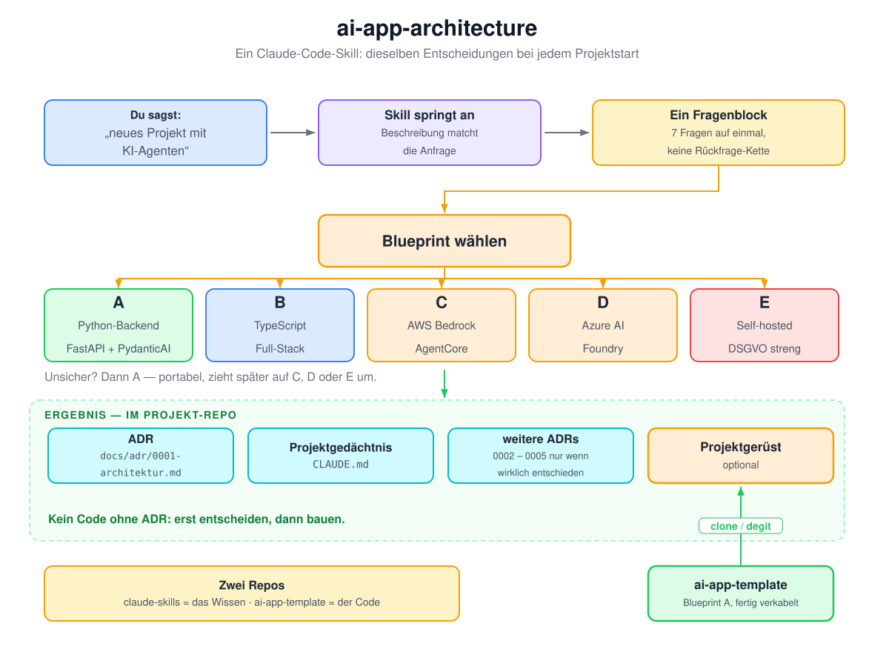

# claude-skills

Meine Claude-Code-Skills. Aktuell einer: **`ai-app-architecture`** – er trifft bei jedem Projektstart
mit KI-Agenten dieselben, belegten Architekturentscheidungen, statt sie jedes Mal neu zu recherchieren.

<p align="center">
  
</p>

<p align="center"><sub><a href="https://excalidraw.com/#json=UWwbVWE2P_53Uja-sxB46,34RXBj8y5bIs3L4wWrKhww">Diagramm in Excalidraw öffnen und bearbeiten</a></sub></p>

---

## Das Problem

Jedes neue KI-Projekt beginnt mit denselben Fragen: Welches Framework? Wo laufen die Modelle?
Wie kommt der Agent an die Daten? Was, wenn morgen ein zweiter Mandant dazukommt? Und ist das
DSGVO-mäßig überhaupt tragbar?

Diese Fragen werden fast immer neu recherchiert, meist unter Zeitdruck, und die Antwort landet
nirgends. Sechs Wochen später weiß niemand mehr, warum es so gebaut wurde.

## Die Lösung

Der Skill macht daraus einen festen Ablauf: **kurzes Interview → Blueprint → dokumentierte
Entscheidung → optional fertiges Gerüst.** Grundlage ist eine Recherche vom August 2026, die als
Referenzdateien im Repo liegt – nachlesbar und korrigierbar.

Die fünf Blueprints sind dabei keine gleichwertigen Menüpunkte. **Blueprint A ist der Default** –
Python-Backend als API (FastAPI + PydanticAI), portabel genug, um später umzuziehen, ohne die
Agent-Logik neu zu schreiben. Von A weicht der Skill nur ab, wenn eine Randbedingung es erzwingt:

| Auslöser | Ausgang |
|---|---|
| Team ist TypeScript **und** das Produkt ist im Kern eine Chat-UI | **B** – TypeScript-Full-Stack |
| Kunde liegt auf AWS | **C** – Bedrock / AgentCore |
| Kunde liegt auf Azure / M365 | **D** – Azure AI Foundry |
| Datenschutz streng, Self-Hosting Pflicht | **E** – self-hosted |

(Kunde auf GCP → Vertex/ADK, analog C/D.) Greift kein Auslöser, bleibt es A.

Ein Template-Repo gibt es bewusst nur für den Default: Templates für Ausnahmefälle würden
veralten, bevor sie je benutzt werden. Entsteht ein echtes B- oder E-Projekt, wird das Template
daraus extrahiert – nicht vorher erfunden.

## Installation

**Persönlich, für alle Projekte** – ein Symlink genügt, Claude Code folgt ihm:

```bash
git clone https://github.com/JulesCyb/claude-skills ~/src/claude-skills
mkdir -p ~/.claude/skills
ln -s ~/src/claude-skills/ai-app-architecture ~/.claude/skills/ai-app-architecture
```

Ein `git pull` aktualisiert den Skill dann in allen Projekten gleichzeitig.

**Nur in einem Projekt:** den Ordner `ai-app-architecture/` nach `.claude/skills/` kopieren und
mitcommitten – dann hat jeder im Repo den Skill.

**Fürs Team:** als Plugin in einem Marketplace veröffentlichen oder über die Managed Settings der
Organisation ausrollen.

## Nutzung

Der Skill springt von selbst an, sobald es um ein neues KI-Projekt, einen Tech-Stack oder eine
Architekturfrage geht. Direkt aufrufen geht auch:

```
/ai-app-architecture
/ai-app-architecture Kundenprojekt Azure, mehrere Mandanten, Android-App geplant
```

Dann kommt **ein** Fragenblock mit sieben Fragen – nicht sieben Rückfragen nacheinander. Was du
nicht beantwortest, wird als Default angenommen und benannt.

## Was dabei herauskommt

- `docs/adr/0001-architektur.md` – die Entscheidung mit Begründung und Alternativen
- `CLAUDE.md` – Projektgedächtnis für Claude Code, ausgefüllt statt generisch
- weitere ADRs, aber nur wenn wirklich etwas entschieden wurde (Mandanten, Modellzugang, Hosting, Mobile)
- auf Wunsch ein lauffähiges Projektgerüst – bei Blueprint A aus **[ai-app-template](https://github.com/JulesCyb/ai-app-template)**, bei B–E eine minimale Struktur laut Blueprint

Grundregel: **kein Code ohne ADR.** Erst die Entscheidung dokumentieren, dann bauen.

## Was im Repo liegt

```
ai-app-architecture/
├── SKILL.md                          Ablauf und Grundsätze – wird bei Aktivierung geladen
├── references/
│   ├── blueprints.md                 A–E im Vergleich, Kosten, Lock-in, Wechselkriterien
│   ├── agent-architektur.md          Backend als API, Tools/MCP, Streaming, State, Mobile Clients
│   ├── mandanten.md                  1 vs. N Mandanten, RLS-Muster (SQL), Kontext-Objekt
│   ├── stack-2026-08.md              Kurzfassung der Recherche: Plattformen, Frameworks, Standards
│   └── recherche-2026-08.md          vollständiger Bericht mit Quellen
├── assets/
│   ├── CLAUDE.md.template            Vorlage fürs Projektgedächtnis
│   ├── adr-template.md               ADR-Vorlage
│   ├── adr-0001-beispiel.md          ausgefülltes Beispiel
│   └── adr-0005-mobile.md            ADR-Vorlage für die Mobile-Entscheidung
└── evals/evals.json                  Testprompts (skill-creator-Plugin)
```

Die Referenzdateien werden **nicht** mitgeladen – Claude liest sie nur, wenn sie gebraucht werden.
Details zum Skill selbst: [`ai-app-architecture/README.md`](ai-app-architecture/README.md).

## Eingebaute Skepsis gegen sich selbst

Die Recherche ist auf `2026-08` datiert. Liegt der Projektstart mehr als etwa ein halbes Jahr
später, weist der Skill von sich aus darauf hin und prüft die aktuellen Docs, bevor Versionen
festgenagelt werden.

Warum das nötig ist: Zwischen Recherche und Bau des Template-Repos wechselte das MCP-Python-SDK von
`FastMCP` auf `MCPServer` (2.0). Prinzipien altern langsam, Produktnamen und Preise schnell.

## Pflege

- Erkenntnis aus einem Projekt (bessere Bibliothek, gescheiterte Entscheidung, Preisänderung)
  → in die passende Datei unter `references/` schreiben.
- `metadata.version` und `metadata.stand` in `SKILL.md` anziehen, Changelog ergänzen.
- Nach größeren Änderungen die Testprompts laufen lassen: `/plugin install skill-creator@claude-plugins-official`,
  dann *"evaluate my ai-app-architecture skill"*. Prüfen, dass der Skill bei „neues KI-Projekt"
  anspringt und bei „CSV analysieren" **nicht**.
- Keine Kundendaten, keine Secrets – nur Prinzipien und öffentlich Bekanntes.

## Changelog

| Version | Was |
|---|---|
| **1.2.0** | Blueprint-Wahl reframed: A ist der Default, B–E sind Ausnahme-Ausgänge mit Auslöser; Template-Repo explizit nur für A |
| **1.1.0** | Mobile Clients: Interview-Frage erweitert, Abschnitt in `agent-architektur.md`, ADR-Vorlage `0005-mobile.md` |
| **1.0.0** | Erste Fassung aus der Stack-Recherche 2026-08 |
